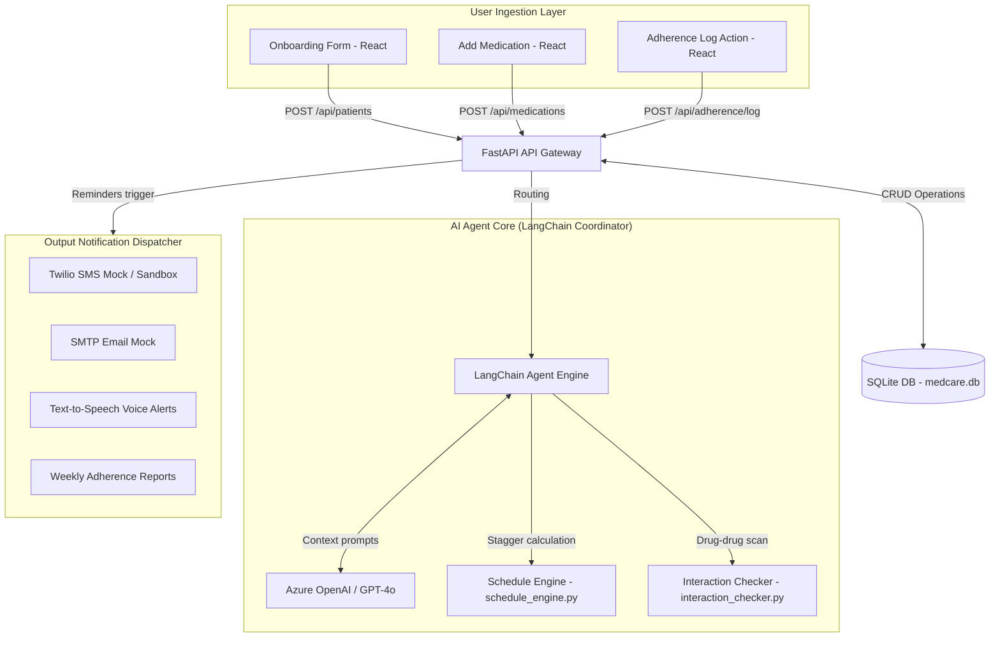

# MedCare AI - System Architecture Document

This document outlines the high-level system design, logical boundaries, data flow, and privacy compliance standards for the **MedCare AI** prototype.

## System Topology & Data Flow

## Core Modules Description

1. **Patient Profile Management**: Stores user metadata (age, routines, accessibility flags) in a relational SQLite structure.
2. **Schedule Engine (`schedule_engine.py`)**: Restricts dose slots within patient sleep/wake bounds and shifts times by 30-minute offsets to prevent overlaps.
3. **Mock Safety Checker (`interaction_checker.py`)**: Intercepts medication registration, scans lists for hazardous pairs (e.g. Warfarin + Ibuprofen), returns clinical summaries, and stops execution until safety overrides are confirmed.
4. **AI Agent Core (`ai_agent.py`)**: Coordinates LangChain chat inputs, applies age-sensitive tone parameters (gentle for seniors, short for busy professionals), reschedules late doses safely based on drug half-lives, and contains localized string fallback templates if offline.
5. **Notification Dispatcher (`notifications.py`)**: Manages multi-channel dispatch pipelines (SMS logs, Email SMTP logs, and gTTS audio conversions).

---

## HIPAA-Aligned Privacy & Data Security

MedCare AI implements the following clinical security practices:
1. **Data Minimization (No PII to LLM)**: Patient PII (e.g. names, phone numbers, emails) is scrubbed or substituted with synthetic session references before logs or query inputs are transmitted to Azure OpenAI.
2. **Environment Secret Boundaries**: All credentials (Twilio tokens, Azure endpoints, SMTP passwords) are loaded dynamically from a git-ignored `.env` file; no hardcoded keys are present in source code.
3. **Data Encryption Standard Note**: In production, the system utilizes AES-256 transparent data encryption at rest (e.g., Azure PostgreSQL encrypted databases) and enforces TLS 1.3 encryption on all in-flight REST transactions.
